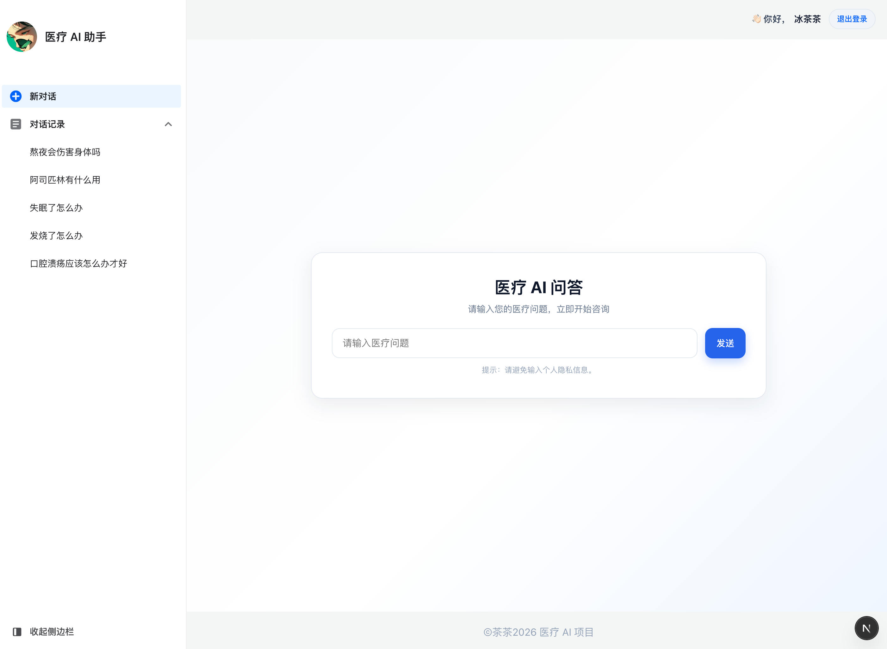
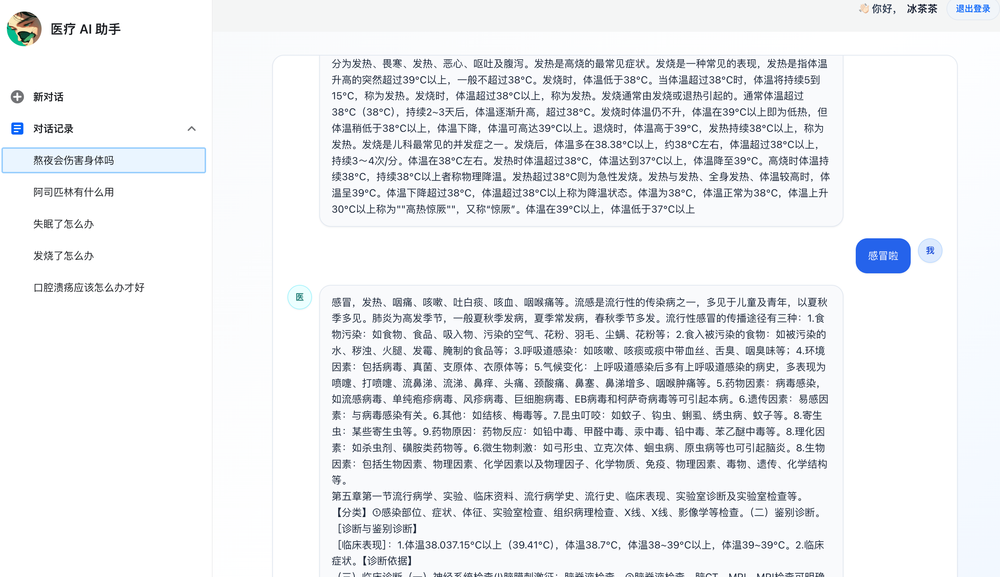

## 简介
这是一个基于 [Next.js](https://nextjs.org) 框架搭建的模型对话前端页面

数据库使用 MySQL，模型使用我自己训练的[医疗大模型（小模型）](https://github.com/Chacha-Bing/med_model_learning)，并且使用 python 来调用模型接口服务

## 关联项目
med_model_learning：https://github.com/Chacha-Bing/med_model_learning
训练模型的输出文章记录：https://juejin.cn/post/7602789520035512330

## Todo

在路径 `src/app/chat/[id]/chatWrapper.tsx` 中存在一个幽灵消息的问题，应该是因为在流式输出完毕后，页面会重新从数据库拉取历史消息，但是这个短短的时间内，addOptimisticMessage 的副作用并没有结束，所以它继续append了一个用户消息，导致了上面那个不正常的UI渲染结果，需要后续抽时间去研究这个”幽灵bug“
